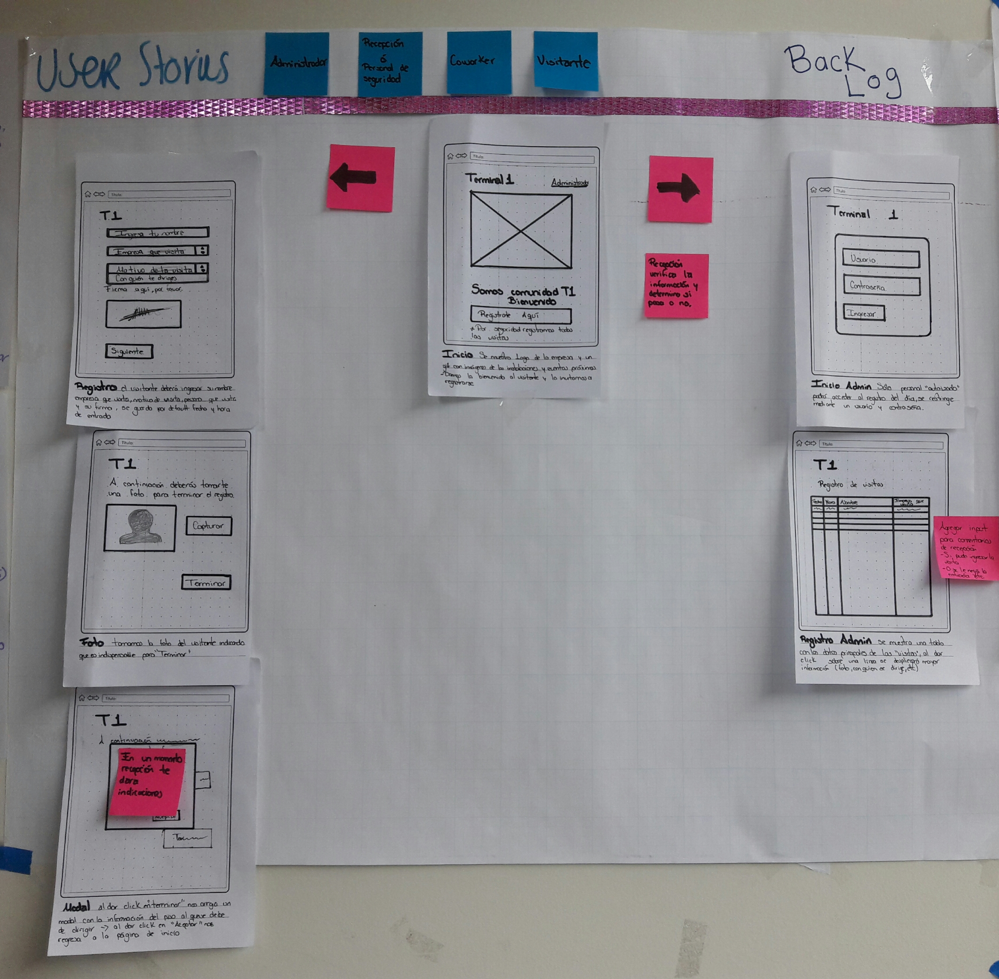

# Proyecto Registro de Usuarios para Coworking

## Preámbulo

El registro de visitantes en una empresa en América Latina es un proceso tedioso y manual. Lo común es que una persona esté en la recepción tomando nota - a veces con papel y lápiz - de cada visitante. Por razones de seguridad, usualmente piden a cada visitante dejar una identificación. Si vivimos en la era digital, ¿por qué seguimos registrando visitantes como si fuera 1985? ¿Qué tal si sustituimos a la persona en recepción por una tablet? ¿Qué tal si en lugar de pedir una identificación, tomamos una foto? ...

## Introducción

En este proyecto la empresa de coworking donde opera Laboratoria en tu ciudad "Terminal 1" ha decidido contratarte a ti y a dos compañeras para reinventar su proceso de registro de visitantes. Con la entrada de WeWork al mercado latinoamericano, tienen mucha más competencia y necesitan invertir en tecnología para mejorar su servicio; el registro de visitantes es un primer acercamiento. Te dan la referencia de [Evoy](https://envoy.com/) en EEUU (un servicio que ofrece un sistema digital de registro de visitantes) y ustedes tienen que desarrollar una versión mínima viable.

**Diseñadora UX**

*Zareth Abarca*

   * Diseñar la experiencia de la aplicación (flujo, interacción, etc.).
   * Identificar, documentar y priorizar las historias de usuario.
   * Crear el diseño visual de la interfaz.

**Desarrolladoras Front-end**

*Florencia Silva Olivera*

*Rocío Angelica Matias Durán*

*Carolina Avilés Lara*

   * Implementar la interfaz de usuario diseñada (HTML/CSS/JS).
   * Deben dividirse las funcionalidades entre las dos desarrolladoras.
   * Todas los desarrollos deben incluir pruebas unitarias.

**Organización**
   [Entregables](https://drive.google.com/open?id=1lVsW9s1L9unYV7HtKu5hi645F_dfOLX6)
   * El equipo organiza y lleva al día su tablero kanban.
   * Los objetivos del proyecto en cuanto a funcionalidad y proceso de UX están de forma visible mediante avisos escritos en el tablero correspondiente.
   * El equipo se comunica mediante un grupo cerrado de Slack.
   * De 8 a.m. a 1 p.m. se avisa personalmente al equipo cualquier alcance logrado o tarea bloqueada.
   * Las implementaciones al proyecto son discutidas antes de ser subidas a Github y mediante Slack se le da aviso a la "Master" (Carolina Avilés) para que reciba el respectivo "pull request".
   * Todas las integrantes del equipo están conscientes de la problemática que se esta resolviendo.
   * Durante el proceso de Sketching todas las integrantes aportan ideas.
   * Conocen las historias de usuario y los puntos de contacto con el cliente. 

# Proceso de UX

## Descubrimiento e investigación 

Un Coworking es un espacio de trabajo compartido e inspirador, que impulsa y fomenta la co-creación y donde siempre hay alguien preocupado en crear comunidad y valor añadido. 

Coworking es la práctica por la cual profesionales que no comparten ni empresa ni sector de actividad, se unen para trabajar juntos en un mismo espacio, sin en cambio el control de las personas que ingresan al edificio u oficinas es muy ambiguo.

Cada espacio de trabajo se maneja de forma diferente en cuanto al control de los Coworkers y los visitantes se refiere, por lo que decidimos hacer una investigación teniendo en cuenta a los participantes de este proceso.

* Usuarios 
- Administrador 
- Recepcionista o personal de seguridad 
- Coworkers
- Visitantes 

## Espacios visitados y características encontradas.

### El 3er espacio 
Ámterdam 240, 4° piso, Hipódromo, CDMX.
Entrevista a Administración.
[Documentación](https://drive.google.com/open?id=1LR6wFwaZzpiQQ3WoN3os-TUwBlppASwn)
* Cuentan con una tarjeta que les da acceso o salida pero es genérica.
* Sus visitantes y Coworkers se registran en una lista de papel.
* Solicitan fecha, nombre, hora de entrada y de salida, en el caso de los visitantes nombre de la persona que buscan.
* La administradora pasa los datos recabados a un excel.
* Usa la data para saber si debe de reservar y cobrar un extra por los espacios usados como por ejemplo la sala de juntas.
* Mediante su archivo de excel da aviso personal a sus Coworkers si el plan contratado ya va a expirar.
* Organiza pequeñas convivencias para crear "comunidad", por lo regular celebra los cumpleaños.
* Para ella es muy importante tener una foto junto a los datos de sus visitantes o coworkers para poder atenderlos mejor ya que hay clientes que únicamente usan ese espacio como dirección fiscal. 

### WeWork -Iron Hack
Insurgentes Sur 601, Nápoles, CDMX.
### WeWork 
Montes Urales 424, Lomas de Chapultepec, CDMX.
Entrevista a Coworker y visita como "cliente incógnito"
[Documentación](https://drive.google.com/open?id=1zB_mVDFGhJQFspkyjmXiHeRg5k3PM3Ux)
* Para entrar al edificio los visitantes se registran en una bitácora.
* Solicitan fecha, hora de entrada y de salida, nombre, empresa que visitan y motivo.
* Usan un registro digital en el que te piden Nombre y el nombre de la persona que visitas.
* Para el registro es necesario tomarse una fotografía.
* Al terminar se te indica que la persona que busacas en un momento "bajará" por ti.
* Los Coworkers pueden descargar una aplicación que sirve para informarse de los eventos que son organizados especialmente para ellos.
* Los Coworkers tienen una tarjeta especial para registrar su entrada y salida.
* La información recabada la puede ver el administrador y la persona que renta un espacio para sus empleados.

### Telmex Hub
Isabel la Católica 51, Centro Histórico, CDMX.
Visita como "cliente incógnito"
[Documentación](https://drive.google.com/open?id=1e2Nqu7OQhEIC4bsvDDWS8UODjVYPO1rB)
* El usuario debe de "crear" una cuenta en su página para poder hacer uso de sus instalaciones sin ningún costo.
* Solicitan nombre, fecha de nacimiento, sexo, intereses, correo electrónico y contraseña.
* Se debe de hacer una reservación con 24 horas de anticipación como mínimo, informando cuantas personas asistirán y si desean ocupar una computadora.
* Por medio de un correo electrónico te confirman si puedes usar el espacio o no.
* Al llegar a las instalaciones esta una mesa con un libro especialmente para seguridad, ahí se registran los visitantes indicando si llevan computadora o artículos de valor.
* Se hace otro registro en la recepción del Coworking mediante unas Laptop, ahí el visitante debe de ingresar el usuario y la contraseña previamente creadas, al terminar aparece un mensaje que dice "La entrada ha sido registrada".
* El personal de la recepción te pide esperar un momento, en lo que visualizan tu registro y te indican en donde puedes trabajar.

### Terminal 1
Tehuantepec 170, Roma, CDMX.
Entrevista a Recepción y seguridad del edificio.
Usuaria habitual.
[Documentación](https://drive.google.com/open?id=1chxVz--lXK3YFdaeRBZREwntLs6M-jBv)
* Tienen dos registros, uno para seguridad y otro para la recepción.
* Solicitan fecha, nombre, empresa, motivo, hora de entrada y hora de salida.
* Hace uso de papel y pluma únicamente.
* Los registros son desechados después de cierto tiempo.
* Tienen bitácoras para uso de bicicletas, impresiones o reserva de espacios.
* El proceso de registro es lento e incluso hay molestias por la espera.
* La recepcionista llama al Coworker para avisar de una visita o entrega de paquetería.
* Usan los registros principalmente por seguridad, pero nos comentan que en caso de siniestro no se llevan ningún "libro".
* Tienen prohibido pedir o quedarse identificaciones por cuestiones de extravío.

# Conclusiones

* Usan los registros por seguridad.
* Siempre hay una persona a cargo de este proceso.
* Los datos que se solicitan repetitvamente son fecha, nombre, hora de entrada y de salida, empresa que visitan y motivo.
* El uso que le dan a esta información depende del usuario (Administrador, Recepción o Seguridad).
* En el caso del Coworking como negocio, siempre están preocupados por crear una comunidad mediante eventos.
* Los puntos de cantacto para los usuarios siempre serán en la entrada principal del edificio y en algunas ocasiones en el piso al que se dirigen se les puede solicitar un registro en específico para la empresa.

## Necesidades de los usuarios 

* Administrador 
Tener un control de las personas que ingresan a mi edificio, como:
 
 Coworkers 
 - Tener un control del tiempo que estan laborando en el edificio, por cuestiones de renta del espacio.
 - Obtener los datos del "arrendatario" como el nombre de la empresa, giro, puesto desempañado, ubicación de la oficina que ocupa, etc. 
 - Actividades que van a desempeñar.
 - Número de visitantes que reciben. 

 Visitantes
- Para fines de seguridad.
- Determinar si asisten a recorridos (posibles clientes). 
- Cuantificar el numero de personas que asiste a los eventos organizados por Terminal 1. 
- Determinar que días necesito reforzar el acceso con más personal por el flujo de personas o recibimiento de paquetería.

Recepcionista o personal de seguridad
- Agilizar el proceso de registro.
- Poder visualizar la información digitalmente.
- Capturar si el visitante puede ingresar o no, y detallar los motivos.
- Tener un registro con la foto de las personas que ingresan o trabajan en el Coworking para poder darles un trato personalizado.

* Pain points: (En sus actividades diarias qué es lo que más les molesta u obstaculiza en el proceso de realizar sus actividades/objetivos)
- La lentitud del registro para los visitantes. 
- Tienen que estar imprimiendo bitácoras constantemente y la pérdida de plumas entorpece el proceso.
- Si hay que consultar su lista de visitantes, deben de buscar línea por línea lo que necesiten sin contar que a veces la letra es ilegible.
- No dan uso a la información recibida a su favor.

## Técnicas usadas en esta fase

- Engage
    * Administradora de "El 3er Espacio" 
    * Recepcionista y Guardia de "Terminal 1"
- Cliente Incógnito
    * WeWork Urales
    * WeWork Insurgentes (Iron Hack)
    * Telmex Hub Isabel la Católica 
- Shadowing
    * Terminal 1
    * Telmex Hub Isabel la Católica
     
### Objetivos del negocio Terminal 1

- Compartir oficina y equipamientos.
- Fomentar las relaciones estables entre profesionales de diferentes sectores que pueden desembocar en nuevas relaciones cliente-proveedor. 
- Generar un sentimiento de pertenencia a una comunidad, más allá de las vinculaciones efectivas que se establezcan entre los trabajadores que frecuentan los espacios de co-trabajo.
- Realizar eventos de integración entre su comunidad.
- Personalizar la interacción del los empleados con los usuarios.​

### Motivaciones del negocio para el Registro de Usuarios

-  Agilizar el proceso de registro y búsqueda de información.
-  Denotar modernidad en sus instalaciones.
-  Terminar con el uso de papel y pluma.
-  Dar un sentimiento de seguridad a Coworkers y visitantes.
-  Registro detallado y digital que pueda ser consultado en cualquier dispositivo.
-  Visualizar, filtrar y agregar comentarios al registro.
-  Poder cuantificar el numéro de personas que accesan al edificio e identificar los motivos, teniendo en cuenta que prodrían surgir nuevos clientes.
-  Promover los eventos realizados en sus instalaciones espacialmente para Coworkers e identificar su nivel de asistencia.

### Síntesis y definición

Ideación

De acuerdo a la investigación realizada nos encontramos con la ambiguedad de los datos que son solicitados al tratar de acceder o rentar un espacio de Cowork, por lo que se piensa en diseñar una plataforma que asegure que los datos solicitados sean claros y resguardados en un sólo lugar.

## Proceso de registro para T1

- Se requiere de una iPad o computadora con conexión a internet que pueda conectarse a la página para el registro. [Liga oficial](https://carisavi21.github.io/registro-de-usuarios/index.html)

- La página de inicio muestra una animación, que muestra los eventos más cercanos que ofrece Terminal 1 para crear una mejor convivencia entre los Coworkers.

- En la parte superior derecha se muestra un título que dice "Adminsitración" enlace por el cual deberá acceder recepción, seguridad o el administrador del edificio.

- El visitante debe de registrarse en la entrada del edificio mediante el iPad asignada para esta actividad, deberá poner Nombre, capturar su foto y firma continuando con los datos de la empresa que visita, motivo y persona con la que se dirige.

- Se muestra un modal que le da la bienvenida al visitante y le pide que espere un momento, mientras recepción le da indicaciones, tiempo en el cual pueden avisar a la persona en cuestión.

- Mediante esta herramienta es posible dar aviso de una visita a los Coworkers vía e-mail.

- El "Administrador" debe iniciar sesión mediante un usuario y contraseña asignados para poder ver la data de los visitantes en tiempo real(foto, nombre, firma, empresa que visita, motivo y persona con la que se dirige).

- Recepción o seguridad podrá registrar si fue posible recibir o no a la persona en cuestión, capturar hora de salida, comentarios, tener la facilidad de buscar por hora y fecha a los asistentes registrados siendo más fácil la ubicación de las personas por la foto capturada así un trato más personalizado.

- Terminal 1 se caracteriza por crear una "comunidad", por lo que para ellos es importante saber si las actividades organizadas repercuten el la interacción entre sus Coworkers,esto se podría cuantificar determinando si en los días que se organizan Workshops, food truck day´s o catas de cerveza hay una mayor afluencia de asistentes.

### Benchmark (externo) 

[Archivo excel con información de los principales competidores](https://drive.google.com/open?id=1TqEPJbQ4lyzZUOCbcar8urPi2tkR6-Ua)

### Target

* 52% de los Coworkers son hombres y el 48% son mujeres.
* La edad promedio de las personas que deciden rentar uno de los espcios es de 39 años.
* El 20% de los usuarios son menores de 30 años.
* Podemos decir que buen número de ellos se dedica al mundo de la creación, del diseño y las nuevas tecnologías, como pueden ser fotógrafos, arquitectos, diseñadores, ingenieros, creativos, periodistas, programadores, y un largo etcétera de profesionales que tienen la oportunidad de ejercer su profesión como freelance y/o de manera más flexible en un entorno estimulante, abierto y adaptado a sus necesidades.

### Argumentación del diseño

Se usan colores característicos de la marca como el gris, blanco y negro principalmente. Terminal 1 descataca por ser casual pero sobria en sus instalaciones.

### Historias de Usuario

* Administrador 
Yo como administrador de un Coworking necesito saber cuantas oficinas tengo ocupadas y por cuanto tiempo fueron contratadas, cuantas personas están trabajando y ocupando mis espacios para determinar si debo de agregar gastor por uso de estos (baños, comedor, salas de juntas, estacionamientos, recepción por cuestiones de paquetería, etc.). Quiero saber el flujo de personas que entran y los principales motivos ya que pueden surgir clientes potenciales o en caso de robo, siniestros o algún tipo de emergencia deb de tener un registro de las personas que se encontraban en el edificio. 

* Coworker
Yo como arrendador de un espacio de Coworking debo de estar al pendiente de cuando expira mi contrato pero a veces por otras distracciones me olvido de estos temas así que me gustaría que hubiese un tipo de recordatorio, me agrada que varias empresas se reunan para laborar en un mismo lugar pero creo que la seguridad que hay en el edificio no es suficiente, he notado que sólo basta con que se anoten en una libreta pueden ingresar, sin ser necesario que dejen idenficación.

* Recepción o seguridad
Como recepcionista necesito agilizar el proceso de registro, ya que en ocasiones se "anota" demasiada gente en el mismo momento e incluso por el tiempo de espera (en lo que terminan de apuntarse las demás personas en la bitácora) hay visitantes que ya no se anotan y eso perjudica mi trabajo porque el control que estoy obligada a llevar se vuelve fidedigno. En caso de emergencias, recados, paquetería etc. debo de estar revisando constantemente la lista de visitantes hoja por hoja hasta encontrar a la persona que llegó a buscar a algunos de nuestros Coworkers y poder darle aviso de forma más detallada. 

* Visitante 
Como visitante de un esporádico de Coworking y demás espacios he notado que hay una gran diferencia entre unas oficinas y otras, algunas cuentan con un sistema digital y otras siguen con el clásico proceso de aputarte en hojas "sueltas" o en un libro y eso te hace perder más tiempo si es que vas de prisa; en una ocasión en recepción extraviaron mi INE y fue muy molesto esperar a que la encontraran, me gustaría que fuera un registro más rápido. 

## Prototipado

<!-- - Flujo inicial 
[Imagen](image/benchmark/Benchmark.xlsx) -->

- Sketch

- Prototipo de alta fidelidad
[Liga de Marvel](https://marvelapp.com/3bicje7/screen/46701850)

- User testing
[Fotos y vídeos](https://drive.google.com/open?id=1NbbIVnRkUbQ-_DGSWNMwZV4BSKq3W-pY)

